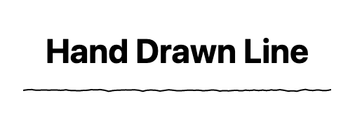

# Drawn Line CSS paintWorklet



[Some examples of what you can do with this on Codepen](https://codepen.io/thomassemmler/pen/JjyErxw).

This really simple paint worklet allows you to draw a horizontal line at the bottom of elements that looks hand-drawn, ish. I made this mostly because I really wanted to have a hand-drawn look for my text-underlines. That's also the reason for why you can't customize for every possible situation. But you could just take the code in `worklet.js` and adopt it to your liking!

## Install it to your project

Paste ye olde npm code into the semi-transparent dark window of your choice:

```bash
npm i drawn-line-paint-worklet
```

And then process the files further to your liking. If you don't do that in your project, going the NPM route is not the way to go. Instead, copy and paste the code, or utilize the CDN.

### Via CDN

```html
<script src="https://unpkg.com/drawn-line-paint-worklet@1.0.0/dist/worklet.js"></script>
```

Make sure to also register the custom properties. See instructions further below.

### Adding the Paint Worklet

If you have the files available to you locally, you can rely on `register.js` to do everything:

```html
<script type="module" src="register.js"></script>
```

The `type="module"` may not be needed, depending of whether and how you process the file(s) in your project. This is not gonna be possible to do with 

`register.js` registers the paint worklet _and_ it registers the CSS custom properties via `CSS.registerProperty()` that you can use to adjust the line generation. This is important, because the [CSS typed OM](https://www.w3.org/TR/css-typed-om-1/) allows for intuitive and easy processing of values.

You can of course do this yourself, if you'd like to do so. In that case, refer to the `worklet.js` file for the paint worklet code and refer to the `properties.js`, or take them to CSS and register them in CSS with `@property` instead - whatever you prefer. But make sure that you **do not skip the step of registering the custom properties in some way**, otherwise the worklet will not work correctly.

## Custom Properties

These are the properties that the paint worklet registers:

| property | purpose | default |
|---|---|---|
| `--drawn-line-color` | `<color>` - set a color for the line | `black` |
| `--drawn-line-strength` | `<length>` - set the thickness of the line | `2px` |
| `--drawn-line-wiggle` | `<integer>` - adjust how _wiggly_ the line is | `1` |
| `--drawn-line-curve-range` | `<length>` - set how high the line can wiggle to the top | `1px` |
| `--drawn-line-segment-size` | `<length>` - set the size of an individual segment, in which curves are being generated | `12px` |